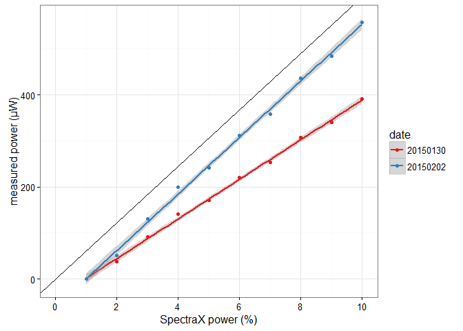
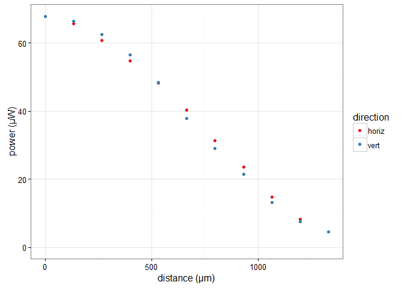

Calibrations for `vng` Nikon Ti
================
Thomas Julou

``` r
library(tidyr)
library(dplyr)
library(ggplot2)
theme_set(theme_bw())
```

Power calibration of Lumencor SpectraX
======================================

Linearity of SpectraX power control
-----------------------------------

Using the Excite powermeter provided by IMCF (centered on the 100x objective using the diascopic illumiation, set on 475nm), power on sample is measured for increasing values of SpectraX intensity (from 1 to 10%).

-   20150130: default aperture and field shutters settings used.
-   20150201: aperture (resp. field) shutters adjusted to most homogeneous (resp. smallest without vigneting) pictures.

``` r
pw_setting <- data.frame(matrix(ncol=3, byrow=TRUE, data=c(
1, 0, 0,
2, 37.2, 51.7,
3, 92.0, 130,
4, 141, 199,
5, 171, 242,
6, 221, 312, 
7, 253, 359,
8, 307, 437,
9, 340, 484, 
10, 391, 558)))
colnames(pw_setting) <- c("setting", "power_20150130", "power_20150202")

pw_setting <- data.frame(pw_setting) %>% 
  gather(var, power, -setting) %>%
  extract(var, 'date', '.*_([[:alnum:]]+)$')
  
ggplot(data.frame(pw_setting), aes(setting, power, col=date)) +
  geom_abline(intercept=0, slope=coef(lm(power~setting, data=subset(pw_setting, date=="20150202")))[2]) +
  stat_smooth(method="lm") +
  geom_point() +
  expand_limits(x=0) +
  scale_x_continuous(breaks=seq(0, 10, 2)) +
  scale_colour_brewer(palette='Set1') +
  labs(x='SpectraX power (%)', y='measured power (µW)')
```



Adjusting the excitation diaphragms results in higher power at a given SpectraX setting.

Cross illumination between neighbouring positions
-------------------------------------------------

Aim: Estimate how much illumination is received between neighbouring positions when a time-lapse is recorder on multiple position.

Setup: Excite power meter covered by a black cardboard cap with a 2mm hole.
Measurements at 475nm with power set to 5%.
The distance is measured from the position of maximum intensity, by increment of 1 field width (133.12um).

``` r
pw_dist <- matrix(ncol=3, byrow=TRUE, data=c(
0, 67.85, 67.9,
1, 65.7, 66.5,
2, 60.85, 62.5,
3, 54.8, 56.5,
4, 48.2, 48.5,
5, 40.4, 37.9,
6, 31.3, 29.0,
7, 23.5, 21.4,
8, 14.8, 13.2,
9, 8.17, 7.52,
10, 4.52, 4.44))
colnames(pw_dist) <- c("d", "pw_horiz", "pw_vert")

pw_dist <- data.frame(pw_dist) %>% 
  gather(var, pw, -d) %>%
  extract(var, 'direction', '.*_([[:alnum:]]+)$') %>%
  mutate(d = d * 133.12)       # convert to microns

qplot(d, pw, col=direction, data=pw_dist) +
  expand_limits(y=0) +
  scale_colour_brewer(palette='Set1') +
  labs(x='distance (µm)', y='power (µW)')
```



Using a 2mm hole, only 40% (67.9/271) of the total intensity can be collected. Moving the stage horizontally or vertically produces similar changes; roughly, 10 adjacent fields (in 1D, ≈100 in 2D) received 50% or more of the excitation light.

Calibrations of Hamamatsu Flash4 camera
=======================================

Intro videos on scientific cameras by Micro-Manager developer
-------------------------------------------------------------

-   [Cameras and Detectors I: How do they work?](http://www.ibiology.org/ibioeducation/taking-courses/cameras-and-detectors-i-how-do-they-work.html)
-   [Cameras and Detectors II: Specifications and Performance](http://www.ibiology.org/ibioeducation/taking-courses/cameras-and-detectors-ii-specifications-and-performance.html)
-   [Camera Calibration](http://www.ibiology.org/ibioeducation/taking-courses/camera-calibration.html)

Overview of our use case
------------------------

At GFP excitation wavelength, the camera quantum efficiency is ≈ 70%, i.e. 1 gray level (aka ADU) corresponds to 1.42 photons received by the pixel during the exposure. In Matthias' experiments, using GFP 9% excitation and 2s exposure, we measure the following intensities:

-   without induction, background intensity ≈ 20 ADU/px (i.e ≈ 30 photons)
-   at full induction, maximum intensity ≈ 5000 ADU/px (i.e. ≈ 7000 photons)

By comparison, read noise is ≈ 2.5 photons (rms^2). Even at low expression, we're exposing long enough so that shot noise is dominating over read noise.

Using air cooling, the dark current is 0.06 electrons/pixel/s.

Improving the fluorescence estimation from raw images
-----------------------------------------------------

### Need for correction

-   without illumination, each pixel has a specific offset and variance (due to the fact that each pixel has its own ADC and electronics; hence rather stable in time).
-   with illumination, each pixel has a specific gain (also due to the fact that each pixel has its own ADC and electronics; hence rather stable in time).
-   sCMOS sensors are known to have rather abundant “defective” pixels (which have either offset or variance much higher than the average, or much lower gain). The camera has a “defect correct mode” that we currently use (enabled by default) where such pixels are stored in memory and interpolated by their neighbours average.

NB: lower temperature of the sensor (achieved with water cooling) reduces the offset of defective pixels.

### Experimental procedure

Recommended background correction: - use the camera with “defect correct mode” ON - measure offset from dark images and gain from quasi-uniform illumination images. - for each raw image, convert it to real numbers, subtract the pixel-specific offset, then divide by the normalised gain value. if the picture need to be saved as 16bit-TIFF, then add a uniform offset (e.g. 100).

NB: In this approach, the “defect correct mode” is kept mostly to handle pixels with high variance.

### Estimating the camera gain and each pixel gain

[Photon-transfer curves](http://harvestimaging.com/blog/?p=1034) are used to estimate the detector's read noise and photon transfer (number of electrons per photon). They are popular because they allow to measure these parameters without absolute measurements of the light input. Although they are usually measured for the whole camera chip, the same concepts can be translated to the pixel level. In this case, they allow to measure the gain of each pixel without requiring uniform illumination of the sensor.
NB: quantum yield is used when a wavelength spectrum is considered.

Experimentally, photon transfer curves are produced by exposing the camera to quasi-uniform illumination (e.g with a LCD screen and a diffuser), and acquiring several time series of images at different exposures. Note again that for pixel gain measurement, the illumination does not need to be uniform provided that it is constant within one image series. Because the dark current is as low as 0.06 electrons/pixel/s (with air cooling), it is low compared to read noise and its changes can be neglected when the exposure is changed during uniform illumiation images acquisition.

#### Read noise and gain estimation from photon-transfer curves

The measured signal of the sensor can be written as \(S_t = k N_o + S_o\). The measured temporal noise on pixel level can be written as \(\sigma_t^2 = k^2 \sigma_r^2 + k^2 \sigma_o^2\). The first term of the sum accounts for the read noise (\(k^2 \sigma_r^2\)), while the second one accounts for the photon shot noise (\(k^2 \sigma_o^2\)).

-   \(S_t\) : measured output signal \[DN\],
-   \(k\) : conversion gain (aka photon transfer) \[DN/e-\],
-   \(N_o\) : number of optically generated electrons,
-   \(S_o\) : offset signal \[DN\],
-   \(\sigma_t\) : total temporal noise measured \[DN\],
-   \(\sigma_r\) : temporal noise associated with the readout channel \[e-\], also the noise floor in dark at 0 s exposure time,
-   \(\sigma_o\) : photon shot noise \[e-\].

At low illumination, read noise dominates the measured noise \(\sigma_{lo}\): \(\sigma_{lo} = k \sigma_r\).

At intermediate illumination, shot noise dominates and its variance equals the signal mean (since shot noise is Poissonian): \(\sigma_{hi}^2 = k^2 \sigma_r^2 + k (S_t – S_o)\).
 i.e. \(\sigma_{hi}^2 = \sigma_{lo}^2 + k (S_t – S_o)\)   i.e. \((\sigma_{hi}^2-\sigma_{lo}^2) - k (S_t – S_o) = 0\)

Typical photon transfer curve analysis consists in estimating the read noise \(\sigma_r\) and the conversion gain \(k\). \(\sigma_r\) is best estimated as the asymptote of \(log(\sigma_t^2) = f(log(S_t – S_o))\). \(k\) is best estimated as the slope of the line in \(\sigma_t^2 = f(S_t – S_o)\) (acquired in the illumination regime where shot noise dominate: \(S_t – S_o \gg \sigma_r^2\)). This can be rephrased as a minimization problem as in Eq. 17 of the supplementary material of (Huang et al. 2013): \(\hat{k} = argmin \sum_{i} \big( (\sigma_{hi, i}^2-\sigma_{lo}^2) - k (S_{t, i} – S_o) \big)^2\) for a sequence (indexed by \(i\)) of intensity time series of a given pixel.

### References

<!-- bibliography is automatically put at the end -->
Huang, Fang, Tobias M. P. Hartwich, Felix E. Rivera-Molina, Yu Lin, Whitney C. Duim, Jane J. Long, Pradeep D. Uchil, et al. 2013. “Video-Rate Nanoscopy Using SCMOS Camera-Specific Single-Molecule Localization Algorithms.” *Nature Methods* 10 (7): 653–58. doi:[10.1038/nmeth.2488](https://doi.org/10.1038/nmeth.2488).
