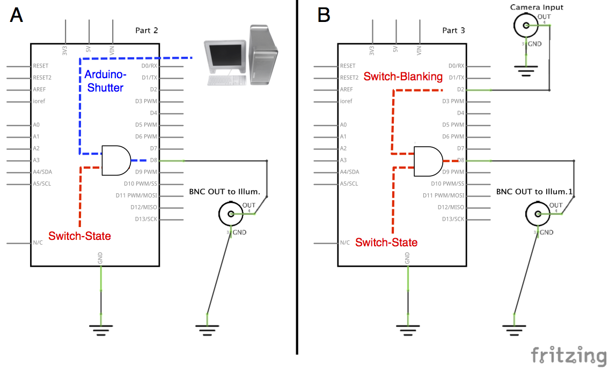
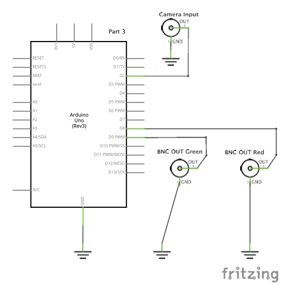
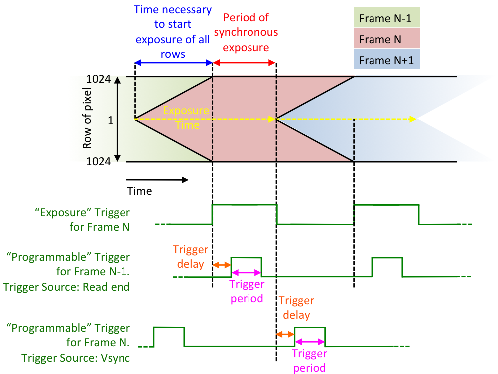

## Motivation

Why you might want to use hardware-triggering to acquire image series is nicely summarized by MM's developers in the Journal of Biological Methods [@edelstein2014advanced]. The principle of hardware-based synchronization is also explained:

> A central capability of μManager is Multi-Dimensional Acquisition (MDA), which allows image sets to be acquired at multiple XY positions, Z slices, time points, and channels. Conventionally, MDA is accomplished by sending commands from the computer to the devices each time a change (in, e.g., stage position or illumination) is required. This communication can add unnecessary latency (up to 100 ms) between image frames. In the case of a time series, the timing to issue commands to the devices and camera is controlled by the application software, a method that cannot consistently produce accurate timings on a standard desktop operating system. The resulting timing jitter can be on the order of tens of milliseconds, unacceptable for fast time series.
> 
> Much faster and accurately timed operation is possible with most cameras (when acquiring a preset sequence of frames) as well as many other devices (when executing a pre-programmed sequence of commands). μManager’s built-in hardware synchronization support can take advantage of these capabilities to perform fast MDA, such as a fast Z stack with a piezo stage or fast multi-channel imaging with lasers shuttered by acousto-optical tunable filters (AOTFs). From the microscope user’s perspective, this is done seamlessly, such that μManager’s MDA engine automatically delegates control to hardware when possible.
> 
> Synchronization between the camera and the other devices is achieved by routing TTL (Transistor-Transistor Logic) pulses over signal cables. In the configuration currently supported by μManager, the camera, operated in sequence acquisition mode, acts as the timing-generating device, sending out TTL pulses at each exposure. The pulses are sent (typically via BNC cable) to a sequencing device, which may be standalone or built into a stage or illumination controller. Upon each pulse, the sequencing device advances the hardware to the correct state for the next exposure, based on a sequence of positions or illumination settings uploaded ahead of time.

Here we describe (i) how we used an Arduino board with a simple custom extension shield to control several TTL-controlled light sources using hardware-triggering and (ii) which external triggers of the camera we use in order to acquire images only once the setup has reached the expected state.

### Capture mode *vs* sequence mode

In order to get a feeling of the difference between capture mode *vs* sequence mode, the easiest is to run Multi-Dimensional Acquisition with time points only. If the delay is shorter than the exposure, the camera is run in sequence mode and the illumination stays on (e.g. a Flash4 connected with USB3 using 33ms delay and 33.3355ms exposure will take 33.99s to acquire 1000 frames, i.e. 34fps). However, if the delay is longer than the exposure, the camera is run in capture mode and the illumination is switched on and off for each frame: the acquisition speed drops (e.g. the same task acquired with 34ms delay takes 373.68s i.e. ≈2.7fps) and the overall timing becomes erratic (not shown).

This clearly illustrates that running the camera in sequence mode with hardware synchronization of devices is a prerequisite for fast-image acquisition. You might think that it would be easier to write your own simple script to control your setup and acquire images in sequence mode. While this is fully possible, setting up your hardware to be "sequencable" gives you access to all the power and flexibility of MDA: set exposure per channels, skip frames / z-stack acquisition for any channel, acquire multiple positions with autofocus, save image with all metadata, etc.

## Integrating several TTL-controlled light sources into a single sequencable device

### Basic Arduino Setup
In order to control our specific setup, which includes two light sources synchronized with the camera, we had to design a very specific Arduino shield. For clarity's sake, we first describe here the simplest Arduino-based setup that can be used to control for example a single illumination source by TTL.

#### First steps

A specific Arduino software has been written to allow the use of an Arduino microcontroller in micromanager. The first thing to do is to flash the Arduino with that software. Then the Arduino has to be installed in micromanager like any other device using the Device Manager. There is a an Arduino Hub to install and several peripheral devices can be chosen. Only Arduino-Switch and Arduino-Shutter are needed.

#### Controlling a ligth source with Arduino
One should see the Arduino like any other device with its micromanager dedicated device adapter. As one would e.g. switch filter cubes on a filter wheel, here one switches Arduino pins ON and OFF. **Six pins (8,9,10,11,12,13) are programmed and can be controlled through the Arduino-Switch-State property by setting the latter to a value between 0 and 63**. The single pins (8,9,10,11,12,13) are switched ON using the values (1,2,4,8,16,32). A pin pattern, i.e. multiple pins switched ON simultaneously, is achieved by just summing up the single pin values. For example pins 8 and 11 are switched ON simultaneously by having Switch-State=9 (1+8) (see https://micro-manager.org/wiki/Arduino for more details). The Arduino can be used as a shutter device (like any other shutter) using the Arduino-Shutter device.

We only need a single pin, e.g. pin8, to switch a single light source ON and OFF. If the light source has a BNC connector, one would thus need the following very simple Arduino setup (A):

We indicated in blue and red the information provided through micromanager settings: the pin pattern (Switch-State) and the Shutter status (Arduino-Shutter) that effectively combine to an AND gate. Only when Switch-State=1 AND Arduino-Shutter=ON, does the light source turn ON. However the setup is still centrally controlled by the computer: the computer asks first the Arduino to turn the ligth on, then the camera to take a picture, and finally again the Arduino to turn the light off. This computer/device communication leads to delays, which for example prolong the sample exposure and induce unnecessary photodammage.

#### Synchronizing the camera and the illumination source through Arduino
To minimize exposure by precisely synchronizing light source and camera, one can have the camera talking directly to the light source. Most modern cameras are capable of sending TTL pulses at specific time points during each frame acquisition (see below under "Flash4 trigger explained" for more details). The idea is therefore to use that camera signal to control when the Arduino pin pattern is active or inactive (blanked). We imagine for the moment that the camera output TTL is ON (high) when exposing and OFF (low) otherwise.

The simplest way of achieving this is to connect the camera trigger output as input to the Arduino pin2 (see figure above, part B). The Arduino has been programmed in such a way that pin8-13 are all OFF if pin2 is OFF (camera not exposing), and conversely pin8-13 are set to the current pattern if pin2 is ON (camera exposing). This effectively amounts to replace the slow computer genereated shuttering (A, blue line) with a fast camera generated shuttering (B, red light). **This feature using pin2 for blanking is only active when the Arduino-Switch property Blanking-Mode is turned ON.**

In this configuration, it is ensured that illumination only happens exactly when the camera is exposing, both in capture and stremaing modes. However it is still the computer that sends commands every time a device has to change state (e.g. switch between two light channels), making timings unreliable. Imagine for example that one wants to acquire a fast two-channels image through the MDA with the setup of the figure below. The computer is going to: 1) set Arduino-Switch=1 (red light), 2) order the camera to take a picture, 3) set Arduino-Switch=2 (green light), 4) order again the camera to take a picture. Hence four slow computer-device communications.

#### Slaving the setup to the camera

To avoid needing the computer to tell devices what to do, the latter need to be able to store sequences of states themselves. Also, in order to synchronize the setup using TTL pulses, those devices need to be able to go through their stored sequence of states upon receiving successive TTL triggers. In micromanager words, devices with those abilities are called sequenceable. **For the Arduino-Switch device this property is activated by setting the Arduino-Switch-Sequence property to ON** (other sequenceable devices have a similar property).

As we have seen above, when run in streaming mode, the camera uses its internal clock to acquire a series of frames. It also still sends a TTL at each frame acquisition. If all devices are sequenceable and connected to the camera via TTL, and the camera itself runs in streaming mode, each device will automatically go through its stored sequence of states upon receiving the successive camera TTL triggers. Hence the camera has become the master of the setup, and the only remaining task required from the computer is to give the GO! for the complete sequence acquisition. In our previous example, the sequence [1,2] is stored on the Arduino-Switch, the computer gives the camera a GO! to acquire a series of two frames in streaming mode and then: 1) camera starts acquiring frame 1 and sends a TTL to Arduino-Switch, which goes to its first stored value Arduino-Switch-State=1 and turns Red illumination ON, 2) exposure is done, camera trigger is OFF (low), light turns OFF, 3) camera starts acquiring frame 2, sends a TTL to Arduino-Switch, which progresses to Arduino-Switch-State=2 and Green ligth turns ON, 4) exposure is done and light turns OFF.

What happens in practice can be summarized as this: 1) one chooses acqusition parameters (illumination settings, number of planes etc.) in the MDA, 2) micromanager transparently transforms those parameters into a sequence of states for each device, 3) the sequences are sent to each device and stored on them, 4) the camera starts acquisition in streaming mode (no communication with computer), 5) every time it takes a picture, the camera sends out a TTL pulse, 6) each device receiving a TTL pulse progresses in its sequence of states.

The only limitation of this setup is the need to acquire all frames at the same exposure time, as changing exposure time is time consuming and cannot be done while in camera streaming mode.

#### Caveats for Arduino shield design

The simple schema presented in the above figure is very simplistic and will probably never be usable as such for two reasons important to consider when designing an Arduino setup. First, the triggers have to have the correct polarity. For example some devices are ON when voltage is low and OFF when voltage is high, while others have the inverse behavior. Hence one has to carefully verify the polarity of the sent and received signals. Second, some TLL work at 5V while others work at 3V (trigger level). Again, one should verify what inputs/ouputs the devices generate/need. Notice that Arduino works at 5V. For simplicity's sake, in the simple examples above, we assumed positive polarity at 5V for all components. In the detailed description of our setup below, several level and polarity changes are needed and the way to achieve them explained.

### Our specific setup
In our setup, the camera is an Hamamatsu Flash4, the transmitted light illumination is produced by a pE-100 (CoolLED) and the epifluorescence illumination by a Spectra X (Lumencor). In principle, the approach described below could be taken to control any set of TTL-controlled light sources.

While there is a device adapter for the Spectra X, the pE-100 require a USB-TTL converter, for instance an Arduino board with the default firmware (a.k.a. AOTF). However, we need the Spectra X to be "sequencable" and, in order to run hardware-triggered MDA with both transmitted light and epifluorescence, to combine the two light sources into a single "sequencable" device. Hence we created a simple custom extension shield allowing to control which channel is active using TTL signals. Hence the shield has one BNC connector to trigger the pE-100 and DB-15HD connector to trigger each LED of the Spectra X individually. The intensity of the Spectra X is still set using the dedicated device adapter. 

### Custom shield design
Several points have been taken into consideration:

- we want to control one TTL output for the pE-100 and 6 TTL outputs for the Spectra X (one per LED). Unfortunately, the default arduino firmware for MM has only 6 outputs. Instead of hacking this firmware and the corresponding device adapter, we took advantage of the fact that we only want LEDs to be active one at a time and used demultiplexer chip ([CD74HCT138](../Manuals/Arduino/cd74hc238.pdf)). Such an IC take a binary signal as input (here 3 bits encoding a 0-7 value) and set the corresponding output pin (out of here 8 pins) active; for instance if the signal (provided by the 3 lowest bits of the arduino `switch state` variable) is b011 then pin 5 is active. The chip we chose is a demux-inverter which means that output pins are HIGH by default and become LOW when active. This is convenient because the Spectra X external trigger is active-low. Output pins 1-6 are connected to DB-15HD connector (a.k.a. VGA connector) following the Spectra X connector mapping. Pin 0 must remain unconnected in order to be able to turn the Spectra X dark.
- in order to save arduino pins for future applications, we control the pE-100 with the eighth pin of the demux-inverter. Since this device is active-high, the output pin 7 of the demux-inverter is connected to a BNC connector through an inverter IC ([MC74H04N](../Manuals/Arduino/mc74hc04.pdf)).
- in order to use hardware-based synchronization, it is important that the arduino has an external trigger connected to its pin 2: illumination will occur only when the camera is exposing (to minimize bleaching and photodamage) and the setup state will be updated every time a new signal is detected. Since the Flash4 outputs 3.3V signals (CMOS logic with ($V_{OH}=2.4V$)), and the arduino logic is 5V ($V_{IH}=3.0V$), a level converter is required to raise the 3.3V signal to 5V; we use a design inspired by Sparkfun's "[Logic Level Converter](https://learn.sparkfun.com/tutorials/bi-directional-logic-level-converter-hookup-guide#board-overview)" with a similar transistor ([Fairchild BS170](../Manuals/Arduino/BS170.pdf)).
- in order to be able to us this shield for software-based control as well, we set a 5V pull-up on the input so that the output is always active when no cable is connected to the input (but when the arduino switch state is 0).

NB: although the demux-inverter has ENABLE inputs that could be use to set all pins inactive when the camera is not exposing (instead of the arduino trigger pin), it is not suitable for hardware-based synchronization since it does not allow the setup state to be updated when a new signal is received.

NB: it is in principle possible to control the pE-100 using a native arduino pin (instead of one of the demux-inverter). But why would you?

### Circuit schematic and control table

A custom DB15HD cable is used since VGA cables have unspecified pins (e.g. 11) which are usually connected to the ground.

The following table recapitulate which pin of the DB-15HD connector controls which LED and the value of arduino's switch state activating the correspomding LED:

Channel | DB15 pin        | SwitchState
--------|-----------------|-------------
Violet  | 13              | 1
Blue    | 12              | 2
Cyan    | 3               | 3
Teal    | 11              | 4 
Green   | 2               | 5
Red     | 1               | 6
GND     | 6-8             | -   
GND     | 10 (other wire) | -
DIA     | BNC (inverted)  | 7

## Hardware triggering applied

### Flash4 trigger output explained

As we have seen in the previous sections, when running a hardware-triggered MDA with sequenceable devices, the camera runs as fast as possible in streaming mode. Also, the camera has to generate a TTL at each frame to drive all devices through their sequence. Modern cameras propose different types of trigger outputs. We describe here settings specific to the Hamamatsu OrcaFlash4 V2 camera.

#### How a CMOS camera works
In order to understand the different types of triggers, one has first to understand a few basic features of CMOS cameras, and in particular the importance of pixel rows. After exposure, the information is readout from the CMOS chip row after row, starting from the central row and progressing towards the chip top and bottom row. Readout takes around 10us/row, and therefore there's a time delay of 10ms between readout of the central and edge pixel rows (for 2048/2 rows). Since in streaming mode the camera operates non-stop, it starts exposing each row right after readout, which means that while the central row has started exposure for the next frame, rows close to the edge are still exposing for the current frame. Hence pixel rows are exposing for the same total time but not at the same time (see figure below).

All possible triggers are set respective to the exposure/readout timings mentioned above, and are explained in detail in the OrcaFlash4 manual. We focus here only on potentially useful triggers for fast MDA acquisitions. We also assume that the camera is working in streaming mode. Note that the trigger level output is 3V. In what follow we call 3V "high" and 0V "low". To simplifiy the discussion, we assume that polarity (see below) is positive, and thus "trigger high" means that the trigger is active.

Within micromanager, the OrcaFlash4 camera has several trigger related properties. Since the camera has three trigger outputs (numbered 1-3 on the back of the camera) all the options appear three times and are numbered [0], [1], [2]. Each trigger output can be set independently from the others. The available options are :

**Trigger polarity**: Defines the polarity of the pulse. If positive, the signal is low by default and the pulse is high. If negative the default is high and the pulse low.

**Trigger kind**: Several options are available, the most usefull being "Exposure" and "Programmable". In **"Exposure"** mode (see figure, first trigger example) the trigger is high when all the pixel rows are exposing **simultaneously**. We have seen above that it takes 10ms to start exposure of all rows. This means that if exposure time is 50ms, the trigger will be low for 10ms and high for the remaining 40ms. In **"Programmable"** mode, a precisely defined pulse can be generated using the additional properties below.

**Trigger Period**: Sets the duration of the "Programmable" trigger pulse

**Trigger Delay**: Sets a time delay before emitting the pulse.  

**Trigger Source**: The above delay counts time since a specific reference event of the frame acquisition process. Trigger Source gives the choice between two reference events. In **"Readout end"** mode (see figure, second trigger example), time is counted from the end of readout, i.e. from the moment the last row of pixels of the current image has been read out by the camera. From the moment where the central row has been read out, it takes 10ms before reading out the last row. Hence after acquiring a frame, the earliest time point where a trigger can be generated is 10ms into acquisition of the next frame. In **"Vsync"** mode (see figure, third trigger example), time is counted from the moment where the central row of pixels has been exposed and read out. For a given frame, since the first row starts exposing at "time = 0" and stops at "time = exposure time", the earliest time point where a trigger can be generated is equal to the exposure time.

Note that Period, Delay and Source properties only affect triggers in "Programmable" mode. Their values are ignored otherwise.

### First use case: Simple camera-light source synchronization 

Here the setup is not used in the MDA sequenceable mode (e.g. just for snaping images or in MDA with channels having different exposure times) but one still wants to make sure the sample is only illuminated when the camera is actually exposing. The following features are needed:

- A light source controlld by Arduino-Switch
- A camera trigger output (e.g. [0]) connected to pin2 of Arduino
- Camera Trigger Polarity[0] = Positive
- Camera Trigger Kind[0] = Exposure
- Arduino-Switch-Blanking-Mode ON
- The other trigger properties are not used.

Notes:

- With the Trigger in Exposure mode, the effective illumination time is 10ms shorter than the explicit value used in micromanager
- During the 10ms without illumination, some pixel row are still exposing. Therefore the microscopy room should be dark.

### Using camera trigger outputs for hardware-triggered control of illumination

Here one wants to achieve harware-triggering in an MDA acquisition, i.e. the camera is a master running in streaming mode that drives all other devices through their sequence of states. One needs:

- A light source controlld by Arduino-Switch
- A camera trigger output (e.g. [0]) connected to pin2 of Arduino
- Camera Trigger Polarity[0] = Positive
- Camera Trigger Kind[0] = Exposure
- Arduino-Switch-Blanking-Mode OFF
- Auto-shutter OFF (the auto-shutter seems to superseed the sequenceable setting)
- Arduino-Switch-Sequence ON
- The same exposure time for all channels
- A multi-channel filter cube. Since the filter cube touret is slow it cannot be used as a sequenceable device and the wole acquisition goes back to the situation described above.

Notes: 

- With the Trigger in Exposure mode, the effective illumination time is 10ms shorter than the explicit value used in micromanager
- During the 10ms without illumination, some pixel row are still exposing. Therefore the microscopy room should be dark.
- Blanking is superseeded by sequencable. However mysteriously when auto-shutter is ON, blanking disables spurious illumination (not during camera exposure)
- Using the trigger in Exposure mode generates additional pulse(s) at the end of the sequence (which don't produce an image). However, the triggering sequence is correctly restarted from the beginning at the next frame / position...

### Hardware-triggered control of z positions

In construction.

<!-- ## Remarks -->

### References
<!-- bibliography is automatically put at the end -->

---
references:
- id: edelstein2014advanced
  type: article-journal
  title: Advanced methods of microscope control using μManager software
  container-title: Journal of Biological Methods
  volume: '1'
  issue: '2'
  DOI: 10.14440/jbm.2014.36
  ISSN: 2326-9901
  language: ENG
  author:
    - family: Edelstein
      given: Arthur D.
    - family: Tsuchida
      given: Mark A.
    - family: Amodaj
      given: Nenad
    - family: Pinkard
      given: Henry
    - family: Vale
      given: Ronald D.
    - family: Stuurman
      given: Nico
  issued:
    date-parts:
      - - 2014
  PMID: '25606571'
  PMCID: PMC4297649
  container-title-short: J Biol Methods
...
