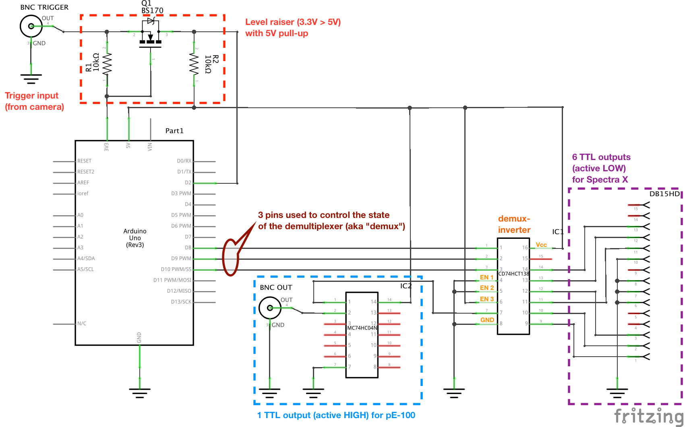

## Motivation

<!-- Micro-Manager is a powerful open-source software for microscope control, offering exquisite control for the acquisition of several channels / positions / time points etc of your sample. In its standard flavour, most users relies on the software to set all devices in the appropriate state before acquiring one image. For instance, in a simple timelapse with 2 channels and 3 time points, the following happens: -->

<!-- - MM sets the setup to `channel 1` state -->
<!-- - MM acquires one frame using the camera in "capture" mode -->
<!-- - MM sets the setup to `channel 2` state -->
<!-- - MM acquires one frame using the camera in "capture" mode -->
<!-- - MM waits until the second time points -->
<!-- - MM sets the setup to `channel 1` state -->
<!-- - … -->

<!-- However, using a camera in "capture" mode has significant overhead and one can hardly reach 3fps, while you might be familiar with running MM in live mode at 30-100Hz depending on your camera. In order to acquire several channels and/or a z-stack faster, it is necessary to use -->

<!-- One of its strength is the ability to control parts from several vendors simultaneously, allowing you to control your setup  -->

Why you might want to use hardware-triggering to acquire image series is nicely summarized by MM's developers in the Journal of Biological Methods [@edelstein2014advanced]. The principle of hardware-based synchronization is also explained:

> A central capability of μManager is Multi-Dimensional Acquisition (MDA), which allows image sets to be acquired at multiple XY positions, Z slices, time points, and channels. Conventionally, MDA is accomplished by sending commands from the computer to the devices each time a change (in, e.g., stage position or illumination) is required. This communication can add unnecessary latency (up to 100 ms) between image frames. In the case of a time series, the timing to issue commands to the devices and camera is controlled by the application software, a method that cannot consistently produce accurate timings on a standard desktop operating system. The resulting timing jitter can be on the order of tens of milliseconds, unacceptable for fast time series.
> 
> Much faster and accurately timed operation is possible with most cameras (when acquiring a preset sequence of frames) as well as many other devices (when executing a pre-programmed sequence of commands). μManager’s built-in hardware synchronization support can take advantage of these capabilities to perform fast MDA, such as a fast Z stack with a piezo stage or fast multi-channel imaging with lasers shuttered by acousto-optical tunable filters (AOTFs). From the microscope user’s perspective, this is done seamlessly, such that μManager’s MDA engine automatically delegates control to hardware when possible.
> 
> Synchronization between the camera and the other devices is achieved by routing TTL (Transistor-Transistor Logic) pulses over signal cables. In the configuration currently supported by μManager, the camera, operated in sequence acquisition mode, acts as the timing-generating device, sending out TTL pulses at each exposure. The pulses are sent (typically via BNC cable) to a sequencing device, which may be standalone or built into a stage or illumination controller. Upon each pulse, the sequencing device advances the hardware to the correct state for the next exposure, based on a sequence of positions or illumination settings uploaded ahead of time.

Here we describe (i) how we used an Arduino with a simple custom extension shield to control several TTL-controlled light sources using hardware-triggering and (ii) which external triggers of the camera we use in order to acquire images only once the setup has reached the expected state.

### Capture mode *vs* sequence mode

In order to get a feeling of the difference between capture mode *vs* sequence mode, the easiest is to run Multi-Dimensional Acquisition with time points only. If the delay is shorter than the exposure, the camera is run in sequence mode (e.g. a Flash4 connected with USB3 using 33ms delay and 33.3355ms exposure will take 33.99s to acquire 1000 frames, i.e. 34fps). However, if the delay is longer than the exposure, the camera is run in capture mode: the acquisition speed drops and the overall timing becomes erratic (e.g. the same task takes 370s i.e. ≈2.7fps).

This already demonstrates that, even without taking into consideration the communication time with lamps, stages, etc, running the camera in sequence mode is a prerequisite for fast-image acquisition.

## Integrating several TTL-controlled light sources into a single sequencable device

### Overview
In our setup, the camera is an Hamamatsu Flash4, the transmitted light illumination is produced by a pE-100 (CoolLED) and the epifluorescence illumination by a Spectra X (Lumencor). In principle, the approach described below could be taken to control any set of TTL-controlled light sources.

While there is a device adapter for the SpectraX, the pE-100 require a USB-TTL converter, for instance an arduino board with the default firmware (a.k.a. AOTF). However, we need the Spectra X to be "sequencable" and, in order to run hardware-triggered MDA with both transmitted light and epifluorescence, to combine the two light sources into a single "sequencable" device. Hence we created a simple custom extension shield allowing to control which channel is active using TTL signals. Hence the shield has one BNC connector to trigger the pE-100 and DB-15HD connector to trigger each LED of the SpectraX individually. The intensity of the Spectra X is still set using the dedicated device adapter. 

### Custom shield design
Several points have been taken into consideration:

- we want to control one TTL output for the pE-100 and 6 TTL outputs for the Spectra X (one per LED). Unfortunately, the default arduino firmware for MM has only 6 outputs. Instead of hacking this firmware and the corresponding device adapter, we took advantage of the fact that we only want LEDs to be active one at a time and used demultiplexer chip (CD74HCT138). Such an IC take a binary signal as input (here 3 bits encoding a 0-7 value) and set the corresponding output pin (out of here 8 pins) active; for instance if the signal (provided by the 3 lowest bits of teh arduino `switch state` variable) is b011 then pin 5 is active. The chip we chose is a demux-inverter which means that output pins are HIGH by default and become LOW when active. This is convenient because the Spectra X external trigger is active-low. Output pins 1-6 are connected to DB-15HD connector (a.k.a. VGA connector) following the Spectra X connector mapping. Pin 0 must remain unconnected in order to be able to turn the Spectra X dark.
- in order to save arduino pins for future applications, we control the pE-100 with the eighth pin of the demux-inverter. Since this device is active-high, the output pin 7 of the demux-inverter is connected to a BNC connector through an inverter IC (MC74H04N).
- in order to use hardware-based synchronization, it is important that the arduino has an external trigger connected to its pin 2: illumination will occur only when the camera is exposing (to minimize bleaching and photodamage) and the setup state will be updated every time a new signal is detected. Since the Flash4 outputs 3.3V signals (CMOS logic with ($V_{OH}=2.4V$)), and the arduino logic is 5V ($V_{IH}=3.0V$), a level converter is required to raise the 3.3V signal to 5V; we use a design inspired by Sparkfun's "Logic Level Converter" with a similar transistor (Fairchild BS170).
- in order to be able to us this shield for software-based control as well, we set a 5V pull-up on the input so that the output is always active when no cable is connected to the input (but when the arduino switch state is 0).

NB: although the demux-inverter has ENABLE inputs that could be use to set all pins inactive when the camera is not exposing (instead of the arduino trigger pin), it is not suitable for hardware-based synchronization since it does not allow the setup state to be updated when a new signal is received.

NB: it is in principle possible to control the pE-100 using a native arduino pin (instead of one of the demux-inverter). But why would you?

### Circuit schematic and control table

A custom DB15HD cable is used since VGA cables have unspecified pins (e.g. 11) which are usually connected to the ground.

The following table recapitulate which pin of the DB-15HD connector controls which LED and the value of arduino's switch state activating the correspomding LED:

Channel | DB15 pin        | SwitchState
--------|-----------------|-------------
Violet  | 13              | 1
Blue    | 12              | 2
Cyan    | 3               | 3
Teal    | 11              | 4 
Green   | 2               | 5
Red     | 1               | 6
GND     | 6-8             | -   
GND     | 10 (other wire) | -
DIA     | BNC (inverted)  | 7

## Using camera trigger outputs for hardware-triggered control of illumination

## Hardware-triggered control of z positions

<!-- ## Remarks -->

### References
<!-- bibliography is automatically put at the end -->
